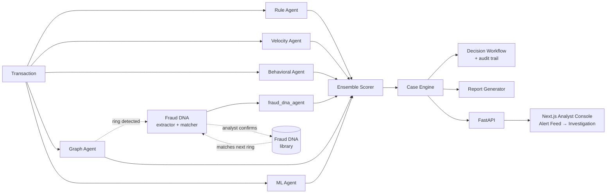

# FraudLens

**AI Fraud Intelligence & Regulatory CaseOps Platform**

Team Phoenix · SHIH-TID-445 · Problem SH-FIN-01 · Smart Horizon 2026 Grand Finale

Built for the Smart Horizon 2026 Grand Finale (03–05 Sep 2026, NHCE Bengaluru), evolving Team
Phoenix's Level 0 and Level 1 concept — the same jury already reviewed that prototype and asked
for more recent AI research and advanced modeling. This build answers that directly with a trained,
benchmarked ML model sitting alongside four independent detection signals.

FraudLens doesn't just answer "is this transaction risky?" It answers: what pattern does this
belong to, have we seen it before, and what should the analyst do next?

## What it does

A transaction enters the system and is independently evaluated by **five scoring agents**, each
looking at a different angle of risk:

| Agent | What it catches |
|---|---|
| **Rule agent** | High amounts, risky merchant categories, odd hours, structuring patterns |
| **Velocity agent** | Transaction bursts — too many, too fast, on one account |
| **Behavioral agent** | Deviation from *this account's own* historical pattern |
| **Graph agent** | Shared devices/IPs across accounts — the signal that catches coordinated rings, not just lone transactions |
| **ML agent** | A trained gradient-boosted classifier learning nonlinear patterns no hand-written rule captures |

A sixth signal, **fraud_dna_agent**, joins the same ensemble vote — not as an afterthought that
only decorates a decision already made, but as a real vote in it. When the graph agent detects a
ring, the cluster is fingerprinted and checked against a **Fraud DNA** library of known fraud
typologies; a strong match measurably raises the score, and abstains cleanly (no false "clear"
vote) on the majority of transactions with no detected ring. Confirmed fraud from an analyst adds
its profile to the library, so the *next* similar ring — under different accounts — gets caught
too. All amounts are in ₹ (INR), matching this problem statement's Indian regulatory context.

Their outputs are combined by a weighted **ensemble scorer** into one decision: clear, review,
block, or block-and-report.

Every analyst decision — confirm, override, escalate — is logged to an **audit trail**, with
ring-linked overrides flagged distinctly from ordinary ones. A **report generator** turns any case
into a structured, masked investigation report ready for compliance review.

## Results

Benchmarked against a labeled synthetic dataset (1,037 transactions, stratified 80/20 split) —
not asserted, measured:

| Agent | Precision | Recall | F1 | AUC-PR |
|---|---|---|---|---|
| rule_agent | 1.000 | 0.529 | 0.692 | 0.852 |
| velocity_agent | 1.000 | 0.162 | 0.279 | 0.664 |
| behavioral_agent | 0.491 | 0.397 | 0.439 | 0.422 |
| graph_agent | 0.383 | 0.721 | 0.500 | 0.567 |
| ml_agent | 0.953 | 0.897 | 0.924 | 0.953 |
| **ensemble** | **0.984** | **0.882** | **0.930** | **0.973** |

The ensemble beats every individual signal — the trained model is the strongest single detector,
and combining it with graph, behavioral, velocity, rule, and Fraud DNA signals still improves on
it further. The `ml_agent` ensemble weight itself was set empirically: swept against this same
benchmark rather than guessed, then capped deliberately below its single-split optimum to keep the
ensemble genuinely multi-signal rather than over-concentrated on one model.

### External validation — a real, published fraud dataset, not just our own

The numbers above are on our synthetic dataset — necessary for having ground truth to benchmark
against, but self-generated. To check the modeling approach holds up on data we didn't create
ourselves, we ran the same model family (`GradientBoostingClassifier`, class-balanced sample
weights) against the **ULB Credit Card Fraud dataset** — 284,807 real, anonymized European card
transactions, 492 confirmed frauds, one of the most cited public fraud benchmarks:

| Dataset | Rows | Fraud rate | Precision | Recall | F1 | AUC-PR |
|---|---|---|---|---|---|---|
| ULB Credit Card Fraud (real, external) | 284,807 | 0.173% | 0.290 | 0.858 | 0.433 | 0.701 |

Lower precision than our synthetic benchmark, and that's expected and honest: this dataset's
features are anonymized PCA components with no merchant/device/IP/account-history fields at all —
genuinely harder than data we built with clear separating signals. An AUC-PR of 0.70 on a real,
0.17%-imbalanced benchmark is a solid, defensible result, not an inflated one. This is deliberately
a **separate model**, not `ml_agent` run unchanged — ULB's feature space is incompatible with
`ml_agent`'s Transaction-based feature extractor, so there's no honest way to swap it in without
fabricating fields the real data never had. See `fraudlens/evaluation/validate_ulb.py`.

## Architecture



## Product

A working analyst console, not a mockup:

- **Alert Feed** (`/feed`) — recent transactions sorted by risk, with the top reason in plain
  language before any technical detail.
- **Investigation view** (`/case`) — leads with the recommendation and confidence, then agent
  evidence, then graph/ring evidence and Fraud DNA match when present, then a decision form that
  writes back through the real API and shows up in the real audit trail.

Design system: cool near-white canvas, graphite navigation rail, cobalt for primary actions, red/
amber/green reserved strictly for risk states, plain language before evidence.

## Engineering quality

- **137 backend tests, all green** (138 with the optional ULB validation downloaded) — schemas,
  all six scoring signals, ensemble math (including the abstain-vs-vote distinction that keeps
  Fraud DNA from wrongly dragging down non-ring transactions), case orchestration, graph/ring
  detection, Fraud DNA matching and library growth, decision workflow, report generation, and full
  API integration tests hitting a live server, not just in-process mocks.
- **Five pull requests, five clean merges, zero conflicts** — four people building in parallel on
  isolated branches (core engine, rules/ML, graph/Fraud DNA, frontend) against a shared contract
  defined once on `main`, never touching each other's files.
- **Frontend**: TypeScript, `npm run build` and lint both clean.
- Every ensemble/report/schema decision along the way was verified against real run output before
  being committed — including catching and fixing gaps found only by exercising the system live
  (a schema field two branches actually needed, a demo script silently hiding a real result, a
  frontend panel rendering raw arrays instead of counts, a currency rescale that had to move the
  Fraud DNA library's amounts and similarity math together or silently break matching).

## Tech stack

**Backend:** Python, FastAPI, Pydantic, scikit-learn, NetworkX
**Frontend:** Next.js (App Router), TypeScript, Tailwind CSS
**Testing:** `unittest` (backend), TypeScript + ESLint (frontend)

## Running it

```bash
# Backend
python -m venv .venv && source .venv/bin/activate
pip install -r requirements.txt
python -m unittest discover -s tests        # 137 tests
python scripts/run_demo.py                  # a real transaction through every agent
uvicorn fraudlens.api.main:app --reload --port 8001

# Frontend (separate terminal)
cd frontend
npm install
npm run dev                                 # http://localhost:3000/feed

# Optional: external validation on real data (see fraudlens/evaluation/validate_ulb.py)
curl -o fraudlens/data/external/creditcard_ulb.csv \
  "https://www.openml.org/data/get_csv/1673544/phpKo8OWT"
python -m fraudlens.evaluation.validate_ulb
```

## Team Phoenix

| Area | Contributor |
|---|---|
| Architecture, core engine, integration | Aahil (Team Lead) |
| Rule/velocity agents, ML model, benchmark suite | Mehul |
| Graph/ring detection, Fraud DNA, decision workflow | Aditya |
| Analyst console (Next.js) | Unnati |
