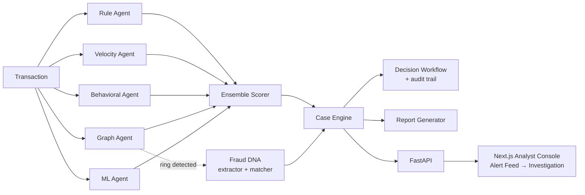

# FraudLens

**AI Fraud Intelligence & Regulatory CaseOps Platform**

Team Phoenix · SHIH-TID-445 · Problem SH-FIN-01 · Smart Horizon 2026 Grand Finale

Built for the Smart Horizon 2026 Grand Finale (03–05 Sep 2026, NHCE Bengaluru), evolving Team
Phoenix's Level 0 and Level 1 concept — the same jury already reviewed that prototype and asked
for more recent AI research and advanced modeling. This build answers that directly with a trained,
benchmarked ML model sitting alongside four independent detection signals.

FraudLens doesn't just answer "is this transaction risky?" It answers: what pattern does this
belong to, have we seen it before, and what should the analyst do next?

## What it does

A transaction enters the system and is independently evaluated by **five scoring agents**, each
looking at a different angle of risk:

| Agent | What it catches |
|---|---|
| **Rule agent** | High amounts, risky merchant categories, odd hours, structuring patterns |
| **Velocity agent** | Transaction bursts — too many, too fast, on one account |
| **Behavioral agent** | Deviation from *this account's own* historical pattern |
| **Graph agent** | Shared devices/IPs across accounts — the signal that catches coordinated rings, not just lone transactions |
| **ML agent** | A trained gradient-boosted classifier learning nonlinear patterns no hand-written rule captures |

Their outputs are combined by a weighted **ensemble scorer** into one decision: clear, review,
block, or block-and-report. When the graph agent detects a ring, the transaction's cluster is
fingerprinted and checked against a **Fraud DNA** library of known fraud typologies — turning a
one-off detection into institutional memory that recognizes a repeat pattern the next time it
shows up under different accounts.

Every analyst decision — confirm, override, escalate — is logged to an **audit trail**, with
ring-linked overrides flagged distinctly from ordinary ones. A **report generator** turns any case
into a structured, masked investigation report ready for compliance review.

## Results

Benchmarked against a labeled synthetic dataset (1,037 transactions, stratified 80/20 split) —
not asserted, measured:

| Agent | Precision | Recall | F1 | AUC-PR |
|---|---|---|---|---|
| rule_agent | 1.000 | 0.500 | 0.667 | 0.854 |
| velocity_agent | 1.000 | 0.162 | 0.279 | 0.654 |
| behavioral_agent | 0.500 | 0.397 | 0.443 | 0.437 |
| graph_agent | 0.383 | 0.721 | 0.500 | 0.567 |
| ml_agent | 0.952 | 0.882 | 0.916 | 0.946 |
| **ensemble** | **0.983** | **0.868** | **0.922** | **0.965** |

The ensemble beats every individual signal — the trained model is the strongest single detector,
and combining it with graph, behavioral, velocity, and rule signals still improves on it further.
The `ml_agent` ensemble weight itself was set empirically: swept against this same benchmark rather
than guessed, then capped deliberately below its single-split optimum to keep the ensemble
genuinely multi-signal rather than over-concentrated on one model.

## Architecture



## Product

A working analyst console, not a mockup:

- **Alert Feed** (`/feed`) — recent transactions sorted by risk, with the top reason in plain
  language before any technical detail.
- **Investigation view** (`/case`) — leads with the recommendation and confidence, then agent
  evidence, then graph/ring evidence and Fraud DNA match when present, then a decision form that
  writes back through the real API and shows up in the real audit trail.

Design system: cool near-white canvas, graphite navigation rail, cobalt for primary actions, red/
amber/green reserved strictly for risk states, plain language before evidence.

## Engineering quality

- **128 backend tests, all green** — schemas, all five agents, ensemble math, case orchestration,
  graph/ring detection, Fraud DNA matching, decision workflow, report generation, and full API
  integration tests hitting a live server, not just in-process mocks.
- **Five pull requests, five clean merges, zero conflicts** — four people building in parallel on
  isolated branches (core engine, rules/ML, graph/Fraud DNA, frontend) against a shared contract
  defined once on `main`, never touching each other's files.
- **Frontend**: TypeScript, `npm run build` and lint both clean.
- Every ensemble/report/schema decision along the way was verified against real run output before
  being committed — including catching and fixing gaps found only by exercising the system live
  (a schema field two branches actually needed, a demo script silently hiding a real result, a
  frontend panel rendering raw arrays instead of counts).

## Tech stack

**Backend:** Python, FastAPI, Pydantic, scikit-learn, NetworkX
**Frontend:** Next.js (App Router), TypeScript, Tailwind CSS
**Testing:** `unittest` (backend), TypeScript + ESLint (frontend)

## Running it

```bash
# Backend
python -m venv .venv && source .venv/bin/activate
pip install -r requirements.txt
python -m unittest discover -s tests        # 128 tests
python scripts/run_demo.py                  # a real transaction through every agent
uvicorn fraudlens.api.main:app --reload --port 8001

# Frontend (separate terminal)
cd frontend
npm install
npm run dev                                 # http://localhost:3000/feed
```

## Team Phoenix

| Area | Contributor |
|---|---|
| Architecture, core engine, integration | Aahil (Team Lead) |
| Rule/velocity agents, ML model, benchmark suite | Mehul |
| Graph/ring detection, Fraud DNA, decision workflow | Aditya |
| Analyst console (Next.js) | Unnati |
