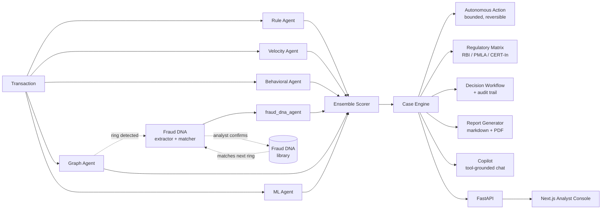

# FraudLens

**AI Fraud Intelligence & Regulatory CaseOps Platform**

Team Phoenix · SHIH-TID-445 · Problem SH-FIN-01 · Smart Horizon 2026 Grand Finale

Built for the Smart Horizon 2026 Grand Finale (03–05 Sep 2026, NHCE Bengaluru), evolving Team
Phoenix's Level 0 and Level 1 concept — the same jury already reviewed that prototype and asked
for more recent AI research and advanced modeling. This build answers that directly with a trained,
benchmarked ML model, five other independent detection signals, a bounded autonomous-action layer,
and Indian regulatory reference context — none of it a mockup.

FraudLens doesn't just answer "is this transaction risky?" It answers: what pattern does this
belong to, have we seen it before, who — or what — should act on it, and under what regulatory
framework does that action fall?

## Live demo

- **Console:** https://fraud-lens.vercel.app — sign in with the seeded accounts below
- **API:** deployed on Render (see `render.yaml`); the frontend talks to it via `NEXT_PUBLIC_API_BASE`
- Seeded accounts: `asharma` / `riyer`, password `fraudlens123`

## What it does

A transaction enters the system and is independently evaluated by **six scoring agents**, each
looking at a different angle of risk:

| Agent | What it catches |
|---|---|
| **Rule agent** | High amounts, risky merchant categories, odd hours, structuring patterns |
| **Velocity agent** | Transaction bursts — too many, too fast, on one account |
| **Behavioral agent** | Deviation from *this account's own* historical pattern |
| **Graph agent** | Shared devices/IPs across accounts, ring membership found via Louvain community detection — the signal that catches coordinated rings, not just lone transactions |
| **ML agent** | A trained gradient-boosted classifier learning nonlinear patterns no hand-written rule captures |
| **Fraud DNA agent** | Matches a detected ring's fingerprint against a growing library of confirmed fraud typologies |

Fraud DNA is a real vote in the same ensemble, not an afterthought decorating a decision already
made: when the graph agent detects a ring (Louvain community detection, not BFS), the cluster is
fingerprinted and checked against the **Fraud DNA** library; a strong match measurably raises the
score, and it abstains cleanly (no false "clear" vote) on the majority of transactions with no
detected ring. Confirmed fraud from an analyst adds its profile to the library, so the *next*
similar ring — under different accounts — gets caught too. All amounts are in ₹ (INR), matching
this problem statement's Indian regulatory context.

Their outputs are combined by a weighted **ensemble scorer** into one decision: clear, review,
block, or block-and-report.

## Beyond detection: action, oversight, and compliance

Detection alone isn't the product — what happens next is:

- **Bounded autonomous action.** The overwhelming majority of cases go to a human, always. A
  narrow exception: when `final_score ≥ 0.90` **and** `confidence ≥ 0.85` **and** (if Fraud DNA has
  an opinion) `similarity ≥ 0.85` all clear *together* — a conjunction, never a single threshold —
  the case is marked `auto_held`. Never `auto_blocked`: there's no real payment gateway behind this
  system, so the only honest framing is "held pending review." The action is logged as its own
  distinct, fully-explainable audit event (`event_type=autonomous_action`, `actor=system`,
  carrying the exact triggering scores), and any analyst decision reverses it immediately and
  permanently — a case is never final without a human able to override it. See
  `fraudlens/core/cases/autonomous_action.py`.
- **Autonomous account-level velocity restriction.** A second, real consequence beyond holding one
  case: when a case clears the auto-hold bar, its *account* is placed under a temporary velocity
  restriction — `VelocityAgent` checks this on every future score for that account and applies
  materially tighter burst thresholds while it's active. A genuine cross-agent effect (the graph/DNA
  agents' finding on one transaction changes how the velocity agent treats the *next* one for the
  same account), not just a wider label. Always reversible the instant a human decides the
  triggering case, logged as its own audit event. See `fraudlens/core/cases/account_restriction.py`.
- **Analyst authentication.** Real JWT-based login (PBKDF2-hashed passwords, seeded demo accounts
  plus self-serve signup) — every decision's `analyst` field comes from the authenticated session,
  never client-supplied text. See `fraudlens/core/auth/`.
- **Live transaction feed.** `/live` streams the real pipeline over Server-Sent Events — each
  transaction is ingested and analyzed live (`runtime.analyze()`, the same call every other route
  uses, not a pre-computed lookup), with each of the six agents' scores revealed as they're
  computed, then the ensemble decision, then any autonomous action it triggers. See
  `fraudlens/api/routes/live.py`.
- **Regulatory reference context.** A dedicated module maps each case's severity (and, for
  cyber-enabled patterns like account takeover or device-farm fraud, its typology) to three real
  Indian frameworks: the **RBI Master Directions on Fraud Risk Management**, **PMLA 2002 §12**
  (Suspicious Transaction Reports to FIU-IND), and **CERT-In's 2022 cyber incident reporting
  directions**. Every reference is hedged explicitly — *"typically reportable under..., not a
  record of any actual filing"* — reference context for the analyst's own judgment, never a claim
  that FraudLens filed anything. See `fraudlens/core/compliance/regulatory_matrix.py`.
- **Audit trail + decisions.** Every analyst decision — confirm, override, escalate — and every
  system action is logged immutably, with ring-linked overrides flagged distinctly from ordinary
  ones. Both a per-case view and a global, cross-case audit log are available.
- **Reports.** Any case becomes a structured, masked investigation report — as JSON, rendered
  markdown, or a real generated **PDF** (`fpdf2`, laid out from the case directly, not a markdown
  screenshot).
- **Copilot.** A tool-calling chat assistant grounded entirely in real case data — the LLM only
  ever picks from a whitelisted tool name; the tool's real `CaseEngine` output is the only source
  of fact; a second call just paraphrases that JSON, so it's structurally resistant to
  hallucinating evidence that doesn't exist. On an unknown transaction, the refusal text comes
  straight from the tool's own error — the LLM is never even called on that path. Live and verified
  end to end against a real Groq key (`fraudlens/core/copilot/`, the "Ask Copilot" panel on every
  case). One real bug found and fixed along the way: Groq decommissioned this app's default model
  mid-build, and its recommended replacement occasionally mis-rendered ₹ as a different currency
  symbol while paraphrasing — corrected with a deterministic regex, not just a prompt instruction,
  since trusting the model to always get it right isn't good enough here.

## Results

Benchmarked against a labeled synthetic dataset (1,037 transactions, stratified 80/20 split) —
not asserted, measured:

| Agent | Precision | Recall | F1 | AUC-PR |
|---|---|---|---|---|
| rule_agent | 1.000 | 0.529 | 0.692 | 0.852 |
| velocity_agent | 1.000 | 0.162 | 0.279 | 0.664 |
| behavioral_agent | 0.491 | 0.397 | 0.439 | 0.422 |
| graph_agent | 0.383 | 0.721 | 0.500 | 0.567 |
| ml_agent | 0.953 | 0.897 | 0.924 | 0.953 |
| **ensemble** | **0.984** | **0.882** | **0.930** | **0.973** |

The ensemble beats every individual signal — the trained model is the strongest single detector,
and combining it with graph, behavioral, velocity, rule, and Fraud DNA signals still improves on
it further. The `ml_agent` ensemble weight itself was set empirically: swept against this same
benchmark rather than guessed, then capped deliberately below its single-split optimum to keep the
ensemble genuinely multi-signal rather than over-concentrated on one model. Live at `/insights`.

### External validation — a real, published fraud dataset, not just our own

The numbers above are on our synthetic dataset — necessary for having ground truth to benchmark
against, but self-generated. To check the modeling approach holds up on data we didn't create
ourselves, we ran the same model family (`GradientBoostingClassifier`, class-balanced sample
weights) against the **ULB Credit Card Fraud dataset** — 284,807 real, anonymized European card
transactions, 492 confirmed frauds, one of the most cited public fraud benchmarks:

| Dataset | Rows | Fraud rate | Precision | Recall | F1 | AUC-PR |
|---|---|---|---|---|---|---|
| ULB Credit Card Fraud (real, external) | 284,807 | 0.173% | 0.290 | 0.858 | 0.433 | 0.701 |

Lower precision than our synthetic benchmark, and that's expected and honest: this dataset's
features are anonymized PCA components with no merchant/device/IP/account-history fields at all —
genuinely harder than data we built with clear separating signals. An AUC-PR of 0.70 on a real,
0.17%-imbalanced benchmark is a solid, defensible result, not an inflated one. This is deliberately
a **separate model**, not `ml_agent` run unchanged — ULB's feature space is incompatible with
`ml_agent`'s Transaction-based feature extractor, so there's no honest way to swap it in without
fabricating fields the real data never had. See `fraudlens/evaluation/validate_ulb.py`.

## Architecture



## Product

A working analyst console, not a mockup — behind a real login, thirteen real pages, every one
wired to a live API call:

- **Landing** (`/`) — the product's front door; even its "live" preview numbers (critical alert
  count, agent averages) are pulled from the real API at render time, not hardcoded.
- **Login / Signup** (`/login`, `/signup`) — real JWT auth gating every console route.
- **Live Feed** (`/live`) — the ingest → score → decide pipeline streamed over SSE as it happens,
  each of the six agents' scores revealed as they're actually computed.
- **Dashboard** (`/dashboard`) — aggregate risk counts, a per-day risk trend, agent performance,
  restricted-account count, recent alerts.
- **Alert Feed** (`/feed`) — recent transactions sorted by risk, plain-language reason first.
- **Investigation** (`/case`) — leads with the recommendation and confidence (with **AUTO-HELD**
  and **ACCOUNT RESTRICTED** badges when the autonomy layer fired), then agent evidence, graph/ring
  evidence and Fraud DNA match, an Ask Copilot panel, and a decision form that writes back through
  the real, authenticated API.
- **Investigations** (`/cases`) — every analyzed case, richer per-signal detail than the feed.
- **Fraud Network** (`/network`) — cross-case ring summary plus the real, masked graph for the
  top ring, with an "Open Full View" link into the dedicated explorer below.
- **Network Explorer** (`/network/explore`) — a full-screen version of the same ring graph with
  search, zoom, and click-to-focus on a node's neighborhood; opens in context from a specific case
  or ring (`?txn_id=` / `?ring=`), not just a bare graph.
- **Fraud DNA** (`/fraud-dna`) — the real 5-pattern seed library with honest per-pattern match
  counts derived from analyzed cases (a pattern with zero real matches shows "0 matches," never a
  fabricated number).
- **Reports** (`/reports`) — every case sorted by risk, real decision status, PDF export.
- **Audit Trail** (`/audit`) — a global, cross-case log with plain-language event text.
- **Performance** (`/insights`) — the benchmark and ULB external-validation numbers, live.

Design system: dark "forensic terminal" theme — near-black canvas, a real physical-glass material
(blur + saturation, layered shadows, never a flat blur), emerald for primary actions and the accent
identity, amber reserved for Fraud DNA/network content, red/amber/green reserved strictly for risk
states. Instrument Sans carries all UI text and headings; Space Mono is reserved for identifiers,
scores, amounts, and timestamps — never mixed. Full spec in `DESIGN.md`; strategic/brand context in
`PRODUCT.md`.

## Engineering quality

- **298 backend tests, all green** (299 with the optional ULB validation downloaded) — schemas,
  all six scoring signals, ensemble math (including the abstain-vs-vote distinction that keeps
  Fraud DNA from wrongly dragging down non-ring transactions), case orchestration, graph/ring
  detection, Fraud DNA matching and library growth, the autonomous-action conjunction (each signal
  individually insufficient, all three together sufficient, reversal survives re-analysis), the
  account-restriction lifecycle (applied, changes real velocity scoring, reversed by a human, all
  end to end against the live API), analyst auth (password hashing, JWT issuance/expiry, decisions
  rejected without a valid session), the live SSE feed (real agent scores, matches a direct case
  lookup, wraps around the dataset cleanly), regulatory-context hedging, PDF generation (including
  a real font-encoding regression for ₹ symbols in agent reason strings), Copilot's tool-grounding
  and currency-symbol correction, decision workflow, report generation, the system-wide console
  endpoints, and full API integration tests hitting a live server, not just in-process mocks.
- **Test isolation**: the suite writes every persisted file (cases, decisions, audit log, Fraud DNA
  library) to a throwaway temp directory instead of the same files the live demo server reads —
  running tests can no longer leak test-analyst names into a running demo's audit trail.
- **Fifteen pull requests, fifteen clean merges** across parallel branches (core engine, rules/ML,
  graph/Fraud DNA, frontend, Copilot + PDF export, autonomy + compliance, fraud-graph visualization,
  the Groq model-deprecation fix) against a shared contract defined once on `main` — main-only
  merges, always independently re-verified (fresh checkout, full diff review, full test rerun)
  before merging, never trusting a branch's own report. One additional PR was opened and later
  closed unmerged after its branch diverged too far from main to reconcile cheaply; the UI work it
  proposed was rebuilt fresh directly against main instead.
- **A real, measured performance bug found and fixed**: the recent-transactions feed was
  re-running the full six-agent pipeline per transaction on every request (1.6s for 25
  transactions, no caching) while every other console route already shared one process-level
  cache — extracted that cache to `fraudlens/api/case_cache.py` and reused it (1.6s → 0.03s), and
  moved its warm-up to server startup so a backend restart never stalls someone's first click.
- **Frontend**: TypeScript, 5/5 Vitest tests, `npm run build` and lint both clean.
- Every decision along the way was verified against real run output before being committed —
  including catching and fixing gaps found only by exercising the system live (a schema field two
  branches actually needed, a demo script silently hiding a real result, a frontend panel rendering
  raw arrays instead of counts, a currency rescale that had to move the Fraud DNA library's amounts
  and similarity math together or silently break matching, a masked-bullet and a literal-₹
  font-encoding bug in the PDF export, and the test-data-pollution issue above).

## Tech stack

**Backend:** Python, FastAPI, Pydantic, scikit-learn, NetworkX, fpdf2, PyJWT
**Frontend:** Next.js (App Router), TypeScript, Tailwind CSS, Instrument Sans + Space Mono
**Testing:** `unittest` (backend), Vitest + React Testing Library (frontend)
**Hosting:** frontend on Vercel, backend on Render (see Live demo below)

## Running it

```bash
# Backend
python -m venv .venv && source .venv/bin/activate
pip install -r requirements.txt
python -m unittest discover -s tests        # 298 tests, isolated temp data files
python scripts/run_demo.py                  # a real transaction through every agent
uvicorn fraudlens.api.main:app --reload --port 8001

# Optional: Copilot needs a Groq key (not required for anything else)
export GROQ_API_KEY="gsk_..."               # verified live end to end; a clean 503 without it

# Frontend (separate terminal)
cd frontend
npm install
npm run dev                                 # http://localhost:3000
# Sign in at /login — seeded accounts: asharma / riyer, password fraudlens123

# Optional: external validation on real data (see fraudlens/evaluation/validate_ulb.py)
curl -o fraudlens/data/external/creditcard_ulb.csv \
  "https://www.openml.org/data/get_csv/1673544/phpKo8OWT"
python -m fraudlens.evaluation.validate_ulb
```

## Submission

- **PPT + video**: [Google Drive link](https://drive.google.com/drive/folders/1a5mHBiuiDmh0zdEyWxXwydZxS7xTcTas?usp=sharing)

## Team Phoenix

| Area | Contributor | GitHub |
|---|---|---|
| Architecture, core engine integration, JWT auth, live SSE feed, account restriction, console UI/performance overhaul | Aahil (Team Lead) | [@aahil62](https://github.com/aahil62) |
| Rule/velocity/ML agents, benchmark suite, PDF report export, Copilot agent, false-positive tracking, model-performance page | Mehul | [@mehul-gg](https://github.com/mehul-gg) |
| Graph/behavioral agents, Fraud DNA, decision workflow, ring detection, fraud network graph + explorer, design system | Aditya | [@Aditya-cyber2006](https://github.com/Aditya-cyber2006) |
| Console scaffold, alert feed, case detail page, bounded autonomous action layer, regulatory reference matrix | Unnati | [@Unnati9945](https://github.com/Unnati9945) |
| Deployment (Render backend + Vercel frontend) | Pratik | [@pratik-dev01](https://github.com/pratik-dev01) |
